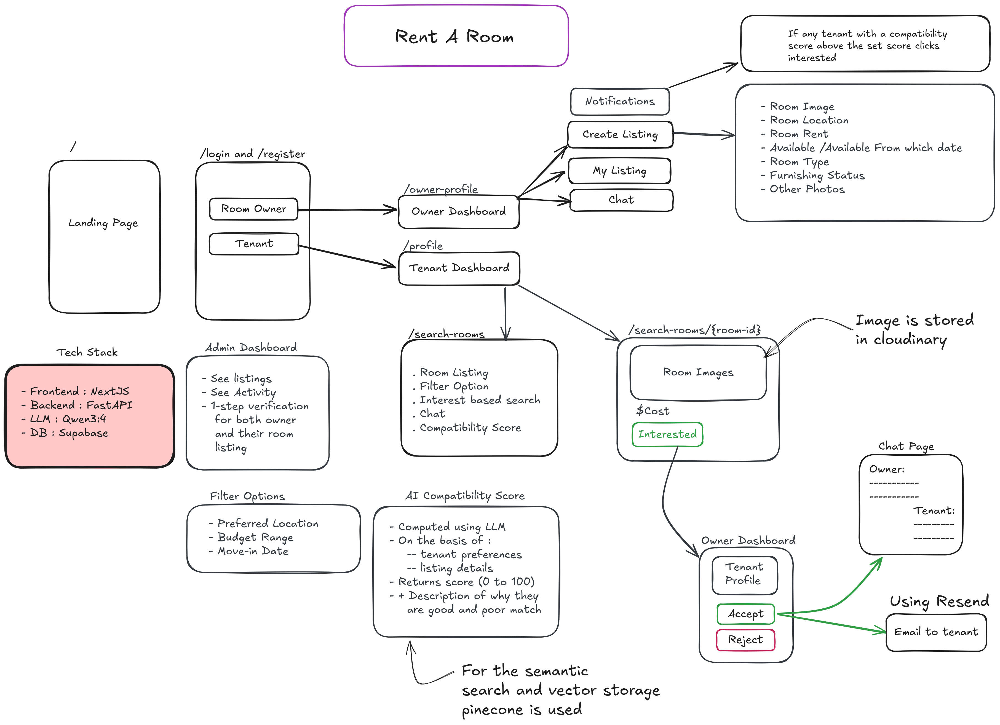

# Rent-A-Room

An AI-powered room rental finder platform. Tenants discover verified listings with semantic search and AI compatibility scoring; owners manage listings, review rent requests, and chat with tenants — all through a modern Next.js frontend backed by a FastAPI API.

---

## Overview

**Rent-A-Room** (also branded as *AI Rent Finder*) connects room seekers with property owners using intelligent matching instead of basic keyword filters.

### High Level Architecture Design



For a deeper breakdown of the architecture, compatibility flow, chat implementation, and notification design, see [SystemDesign.md](SystemDesign.md).

### Key features

| Area | What it does |
|------|----------------|
| **AI compatibility engine** | Analyzes lifestyle signals and listing metadata to produce match scores, strengths, and recommendations via Ollama (`qwen3:4b`). |
| **Semantic search** | Pinecone vector search plus sentence-transformer embeddings for natural-language room discovery. |
| **Verified listings** | Owners create and manage rooms with images (Cloudinary), amenities, and availability. |
| **Rent requests** | Tenants submit requests; owners approve, reject, or hold — with optional email notifications (Resend). |
| **In-app chat** | Real-time-style messaging between tenants and owners. |
| **Role-based dashboards** | Separate flows for **tenants**, **owners**, and **admins** with analytics and profile management. |

### Verified Outcomes

- Ranked listings are surfaced with AI compatibility scores, real-time chat, and event-based email notifications. ✅
- Owners can register, log in, and publish room listings with location, rent, availability date, room type, furnishing status, and photos. ✅
- Tenants can register, log in, and create profiles with preferred location, budget range, and move-in date. ✅
- Tenants can browse and filter listings by location and budget, with results ranked by compatibility score. ✅
- The LLM-generated compatibility score evaluates tenant preferences against listing details and returns a 0-100 score with a short explanation of the match. ✅
- Tenants can send interest requests to owners, and owners can accept or decline them. ✅
- After acceptance, both parties can chat in real time over WebSocket, with messages persisted in the database. ✅
- Owners receive an email when a tenant with a high compatibility score, such as above 80, expresses interest. ✅
- Tenants receive an email when an owner accepts or declines their interest. ✅
- Owners can mark listings as filled, and filled listings are removed from search results. ✅
- Admins can manage users, listings, and platform activity. ✅

### Tech stack

| Layer | Technology |
|-------|------------|
| Frontend | Next.js 13, React 18, TypeScript, Tailwind CSS, Zustand |
| Backend | FastAPI, SQLAlchemy (async), PostgreSQL |
| AI / Search | Ollama, Pinecone, Sentence Transformers, LangChain |
| Media | Cloudinary |
| Email | Resend (optional) |

### Project structure

```
Rent-A-Room/
├── frontend/          # Next.js app (http://localhost:3000)
├── backend/           # FastAPI API (http://localhost:8000)
│   ├── app/           # Routes, models, services
│   ├── requirements.txt
│   └── .env.example   # Environment template (tracked in git)
└── Readme.md
```

---

## Prerequisites

Install the following before setup:

- **Node.js** 18+ and **npm**
- **Python** 3.10+ (3.12 recommended)
- **PostgreSQL** database (e.g. [Supabase](https://supabase.com) free tier)
- **[Ollama](https://ollama.com)** for local LLM inference
- Accounts / API keys for **Cloudinary** and **Pinecone** (see [Environment variables](#environment-variables))

---

## Environment variables

All backend configuration lives in `backend/.env`. Use the tracked template as a starting point:

```bash
cd backend
cp .env.example .env
```

Edit `backend/.env` and set your real values. The table below lists every variable:

| Variable | Required | Description |
|----------|----------|-------------|
| `DATABASE_URL` | Yes | PostgreSQL connection string (Supabase or self-hosted). |
| `JWT_SECRET_KEY` | Yes | Secret for signing auth tokens. Generate with `openssl rand -hex 32`. |
| `JWT_ALGORITHM` | No | Default: `HS256`. |
| `ACCESS_TOKEN_EXPIRE_MINUTES` | No | Default: `1440` (24 hours). |
| `CLOUDINARY_CLOUD_NAME` | Yes | Cloudinary cloud name for image uploads. |
| `CLOUDINARY_API_KEY` | Yes | Cloudinary API key. |
| `CLOUDINARY_API_SECRET` | Yes | Cloudinary API secret. |
| `PINECONE_API_KEY` | Yes | Pinecone API key for vector search. |
| `PINECONE_HOST` | Yes | Pinecone index host URL from your dashboard. |
| `OLLAMA_BASE_URL` | No | Default: `http://localhost:11434`. |
| `OLLAMA_MODEL` | No | Default: `qwen3:4b`. Must match a model pulled in Ollama. |
| `RESEND_API_KEY` | No | Resend API key for email notifications. Leave empty to skip emails. |
| `EMAIL_FROM` | No | Sender address for Resend. Default: `Rent-A-Room <onboarding@resend.dev>`. |

> **Note:** `.env.example` is committed to the repository so new contributors know what to configure. Your actual `backend/.env` is git-ignored and must never be pushed.

The frontend talks to the backend at `http://localhost:8000` (hardcoded in `frontend/lib/store.ts` for local development).

---

## Setup (one-time)

Run these steps once after cloning the repository.

### 1. Backend — Python virtual environment and dependencies

```bash
cd backend

# Create and activate a virtual environment
python3 -m venv .venv
source .venv/bin/activate        # Linux / macOS
# .venv\Scripts\activate         # Windows

# Install Python packages
pip install -r requirements.txt

# Create your local env file from the template
cp .env.example .env
# Then edit .env with your API keys and database URL
```

### 2. Frontend — Node dependencies

```bash
cd frontend
npm i
```

### 3. Ollama — install model

Install [Ollama](https://ollama.com/download), then pull the model used for AI compatibility scoring:

```bash
ollama pull qwen3:4b
```

---

## Running the application

You need **three terminals** for full functionality. Start them in this order:

### Terminal 1 — Ollama (AI server)

```bash
ollama serve
```

If Ollama is already running as a system service, you can skip this step. Ensure the model is available:

```bash
ollama pull qwen3:4b
```

### Terminal 2 — Backend (FastAPI)

```bash
cd backend
source .venv/bin/activate        # activate venv if not already active
uvicorn app.main:app --reload --port 8000
```

- API root: [http://localhost:8000](http://localhost:8000)
- Interactive docs: [http://localhost:8000/docs](http://localhost:8000/docs)

On first startup the backend auto-creates database tables from SQLAlchemy models.

### Terminal 3 — Frontend (Next.js)

```bash
cd frontend
npm run dev
```

- App: [http://localhost:3000](http://localhost:3000)

---

## Quick start checklist

```bash
# One-time setup
cd backend && python3 -m venv .venv && source .venv/bin/activate
pip install -r requirements.txt && cp .env.example .env
# → edit backend/.env with your keys

cd ../frontend && npm i
ollama pull qwen3:4b

# Every time you develop (3 terminals)
ollama serve                                          # Terminal 1
cd backend && source .venv/bin/activate && uvicorn app.main:app --reload --port 8000   # Terminal 2
cd frontend && npm run dev                            # Terminal 3
```

---

## API overview

| Prefix | Purpose |
|--------|---------|
| `/api/auth` | Register, login, profile |
| `/api/rooms` | Listings CRUD, search, image upload |
| `/api/requests` | Rent request workflow |
| `/api/chats` | Messaging between users |

Full endpoint documentation is available at [http://localhost:8000/docs](http://localhost:8000/docs) when the backend is running.

---

## Troubleshooting

| Issue | Fix |
|-------|-----|
| Backend fails on startup with missing env vars | Ensure every **Required** variable in the table above is set in `backend/.env`. |
| AI compatibility scores not working | Confirm `ollama serve` is running and `ollama list` shows `qwen3:4b`. |
| Image upload errors | Verify Cloudinary credentials in `.env`. |
| Search / matching degraded | Check Pinecone API key and `PINECONE_HOST` match your index. |
| Emails not sent | `RESEND_API_KEY` is optional; without it, emails are logged and skipped. |
| Frontend cannot reach API | Backend must be on port `8000`; frontend expects `http://localhost:8000`. |

---